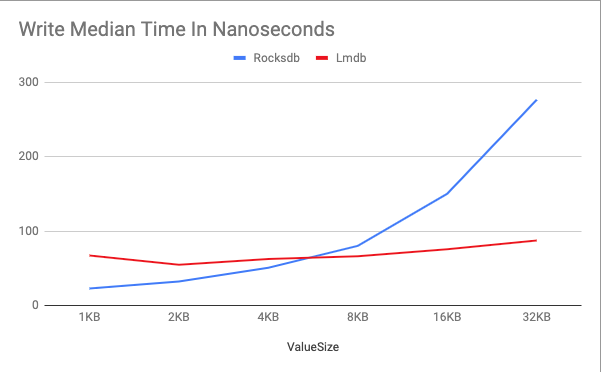
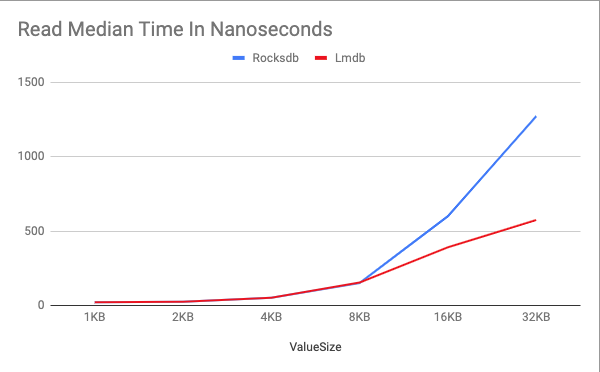

# Rocksdb v.s Lmdb

这个文档包含了 Rocksdb 和 LMDB 简单的性能测试对比，使用的 rust wrapper 分别是这两个项目：
https://github.com/rust-rocksdb/rust-rocksdb
https://github.com/AltSysrq/lmdb-zero

## 项目对比

### 简介
[Rocksdb](https://github.com/facebook/rocksdb/) 是 Facebook 基于 Google LevelDB 开发的嵌入式 Key-Value 数据库，采用 LSM tree存储引擎，License 是 GPLv2 和 Apache 2.0 双重 License ，C++ 实现，社区驱动的 PR 和 issue 比较多，活跃开发中。它的 rust wrapper 项目也处于活跃的维护状态。

[LMDB](https://symas.com/lmdb/) 是 [OpenLDAP](https://www.openldap.org/) 这个开源项目背后的 Symas 公司从该项目中抽取出来的，采用 mmap 和 b+ tree，License 是 OpenLDAP Public License (类似BSD 3), github 上只有它的镜项 repo，PR 和 issue 只在上游的 OpenLDAP 项目中被接受，活跃开发者只有项目的核心成员。由于它本身的功能非常简洁，又是纯C实现，所以 rust wrapper 项目比较稳定，开发不活跃。

### ACID
Atomicity: Rocksdb 默认的写入操作是非原子性，需要用 WriteBatch api 来实现。LMDB 的写入是原子性的，所有的写入操作必须通过 WriteTransaction api 来进行。
Consistency: Rocksdb 提供了 Snapshot api 来提供一致性的 readonly view。 LMDB 在 ReadTransaction 打开的过程中，保证提供一致性。
Isolation: Rocksdb 通过 log sequence number 来实现事务隔离，和常见的关系型数据库类似，也有 pessimistic 和 optimistic 事务 (不过好像 rust wrapper 还没有这个功能)。LMDB 则是用一个写锁序列化了所有的写操作，事务隔离非常简单，但这样就无法支持多线程写入。
Durability: Rocksdb 默认是异步 flush 到 IO，配置成同步写入会严重降低写入性能。而 LMDB 默认是同步写入。在性能测试中为了一致性，LMDB 也配置成了异步写入。

### 量级
从嵌入式角度来看，LMDB 比 Rocksdb 更轻量，编译出来的 binary size 和 启动速度都差了一个数量级 (几十 KB vs 几百 KB，几十毫秒 vs 几百毫秒)，但是因为存储结构的不同，LMDB 的存储所需空间差不多是 Rocksdb 的 2~3 倍。

### 限制
LMDB 的 Key 最大长度是 512 bytes，超过这个长度的支持需要修改默认编译选项，但是会带来性能的影响。

## 性能测试

> 所有的性能测试都不可信

以下测试数据用的 Rocksdb 和 Lmdb 默认配置，配置的优化和测试机器的不同可能带来完全不同的测试结果，这里不提供测试机器的具体配置，图表仅供参考。

图表用了固定的 32 bytes 做为 key，在数据库中填充 3 (batch) * 30000，共计 90000 个 N kb value ，然后随机读取 5000 个
```
./example-bench.sh 1024 30000 5000
```



Rocksdb 的写入时间和数据大小基本成正比，而数据大小给 LMDB 写入时间的影响要小很多。



在小数据量的情况下，Rocksdb 和 LMDB 的读取性能基本一致，随着数据量的增大，Rocksdb 读取数据的变化比 LMDB 要高很多。
